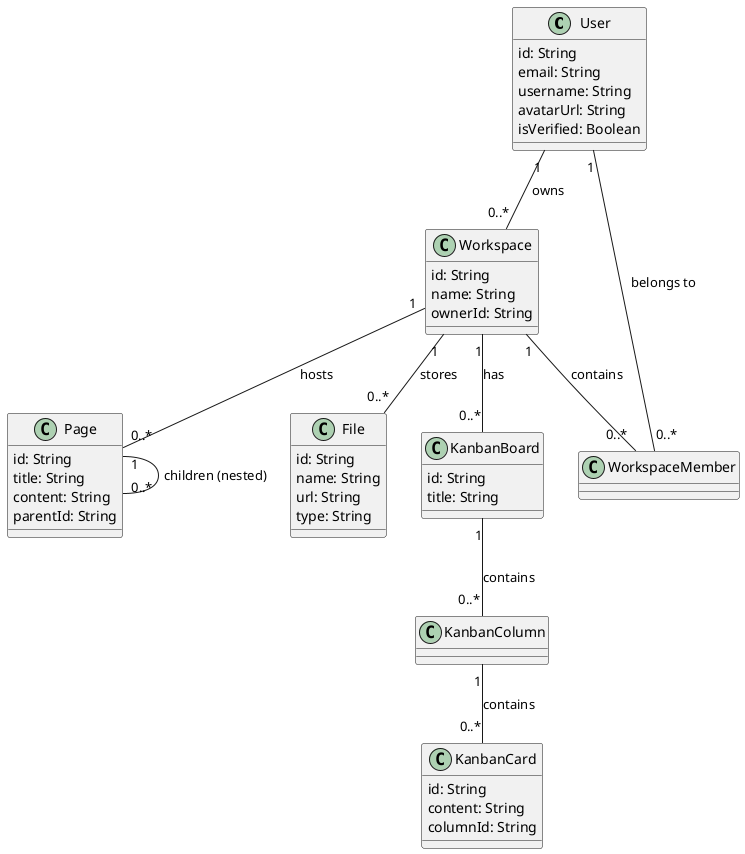
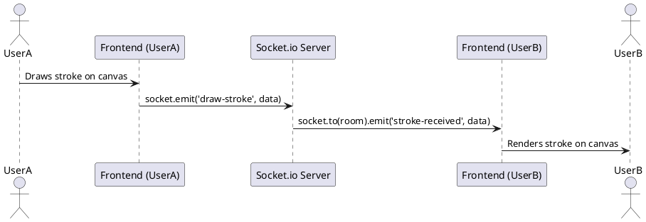
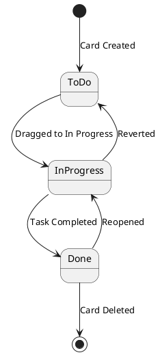
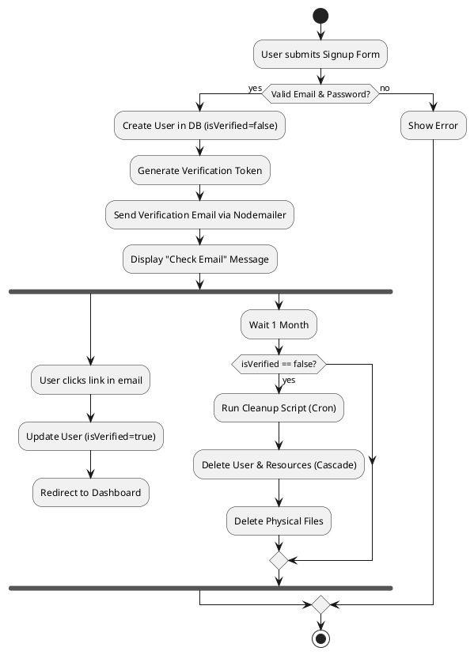
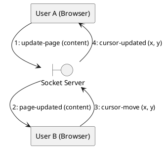
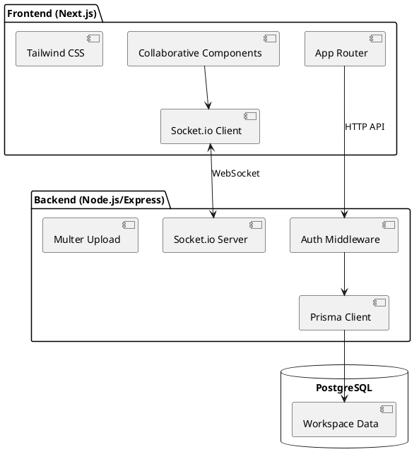
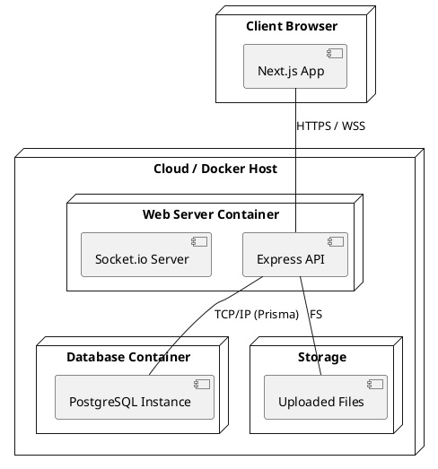
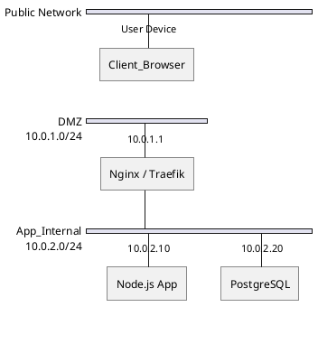

# 📄 Notion Clone - System Documentation

This document provides a comprehensive technical overview of the Notion Clone project, including use cases, architectural diagrams, and data models.

---

## 🚀 1. Use Case Diagram & Scenarios

### 🛠 Core Use Cases
- **Authentication**: Users can sign up, log in, verify email, and reset passwords.
- **Workspace Management**: Owners can create workspaces, invite members, and manage roles.
- **Collaborative Page Editor**: Real-time Markdown editing with live cursor tracking.
- **GitHub-like File Explorer**: Upload, download, and preview files with syntax highlighting for code.
- **Collaborative Drawing Canvas**: Real-time sketching with room-based isolation and state synchronization.
- **Team Chat**: Instant messaging within workspaces.
- **Kanban Boards**: Task management with drag-and-drop, multi-assignment, and custom column colors.
- **Profile Management**: Update user profile details (avatar, username).

### 🎬 Key Scenarios
1.  **Real-time Collaboration**: Alice and Bob are in the same Page. Alice types; Bob sees the update instantly via Socket.io. Bob's cursor moves; Alice sees Bob's named cursor at the exact insertion point.
2.  **Resource Integration**: A developer uploads a `.py` script to the File Explorer. Another team member previews the code directly in the browser with syntax highlighting and then links it to a Kanban card.
3.  **Creative Brainstorming**: A team joins a "Drawing" room. New joiners automatically request the current canvas state from existing users to ensure everyone sees the same sketch.

---

## 📊 2. Database Schema (ERD/ORD)

The system uses **PostgreSQL** (managed via Prisma ORM) to persist workspace data.

### 📝 Entity Relationship Description
- **User**: The central entity. Owns workspaces, participates as a member, authors pages, files, and chat messages.
- **Workspace**: A container for all resources. Has a 1:N relationship with Pages, Files, Folders, Drawings, ChatRooms, and KanbanBoards.
- **WorkspaceMember**: A join table managing the M:N relationship between Users and Workspaces with specific roles (OWNER, ADMIN, MEMBER).
- **Page**: Support nested hierarchy (self-relation). Linked to a Workspace and an Author.
- **Folder/File**: Folders support nested hierarchy. Files belong to a Folder and a Workspace.
- **Kanban**: A Board contains Columns, which contain Cards. Cards can have multiple Assignees (Users).

---

## 🎨 3. PlantUML Diagrams

### 🏗 Class Diagram (Object-Relational View)

### 🔄 Sequence Diagram: Real-time Drawing Stroke

### 📉 State Chart Diagram: Kanban Card Lifecycle

### 🏃 Activity Diagram: User Registration & Verification

### 🤝 Collaboration (Communication) Diagram: Real-time Page Edit

### 🧩 Component Diagram

### 🚢 Deployment Diagram

### 🌐 Network Diagram

