# 📄 Notion Clone - System Documentation

This document provides a comprehensive technical overview of the Notion Clone project, including use case specifications, architectural diagrams, and data models.

---

## 🚀 1. Use Case Diagram & Specifications

### 📊 Standard UML Use Case Diagram
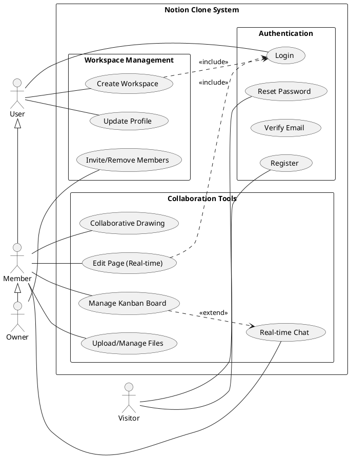

### 📋 Use Case Specifications

| Use Case | Register |
| :--- | :--- |
| **Actors** | New visitor |
| **Function** | 1. User opens registration form.<br>2. Enters email & password.<br>3. Client validates input format.<br>4. System checks if email already exists.<br>5. Password is hashed and user record is saved. |

| Use Case | Login |
| :--- | :--- |
| **Actors** | User |
| **Function** | 1. User enters email and password.<br>2. System validates credentials against database.<br>3. System generates a JWT token.<br>4. Token is sent to the client and stored in localStorage. |

| Use Case | Create Workspace |
| :--- | :--- |
| **Actors** | User |
| **Function** | 1. User clicks "New Workspace" button.<br>2. Enters workspace name.<br>3. System creates workspace record and assigns the user as "OWNER".<br>4. Dashboard refreshes to show the new workspace. |

| Use Case | Invite Member |
| :--- | :--- |
| **Actors** | Workspace Owner |
| **Function** | 1. Owner opens "Workspace Settings".<br>2. Enters invitee's email address.<br>3. System verifies user exists.<br>4. System creates "WorkspaceMember" record with "MEMBER" role. |

---

## 📊 2. Database Schema (ERD)

The system uses **PostgreSQL (via Supabase)** managed by Prisma ORM.

### 🏗 Class Diagram (Detailed Object-Relational View)
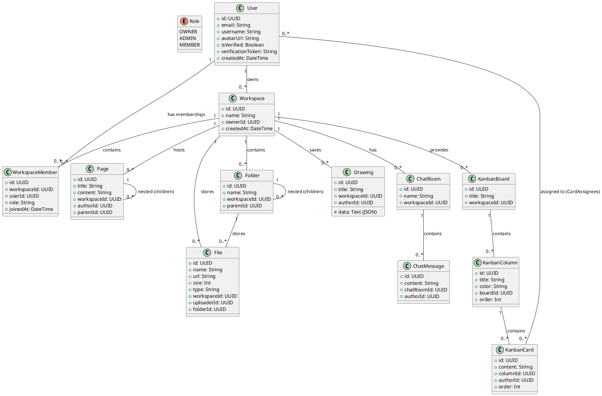

### 📉 2.4 State Chart Diagrams (Төлөв шилжилтийн диаграмм)

#### A. User Account Lifecycle (Хэрэглэгчийн бүртгэлийн төлөв)
Энэхүү диаграмм нь хэрэглэгчийн бүртгэл үүсэхээс эхлээд баталгаажуулах, нууц үг сэргээх болон системээс автоматаар устах хүртэлх төлөвүүдийг харуулна.

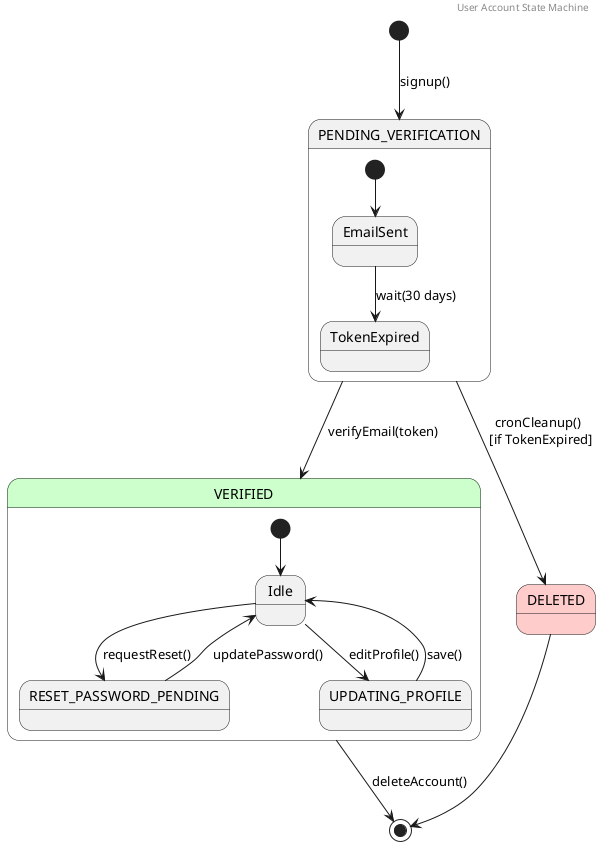

#### B. Kanban Task Lifecycle (Канбан картын төлөв)
Даалгавар үүсэхээс эхлээд гүйцэтгэлийн явцад шилжих болон дуусах хүртэлх төлөвийн шилжилтүүд.

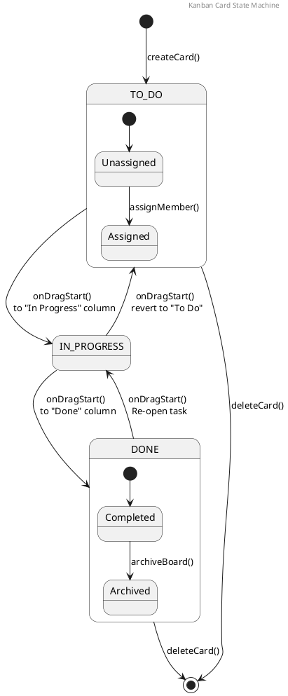

### 🗄 2.5 Database Schema (DBML for dbdiagram.io)
Энэхүү кодыг [dbdiagram.io](https://dbdiagram.io) дээр ашиглан интерактив ERD диаграмм үүсгэх боломжтой.

```dbml
// Use this code at dbdiagram.io to generate a professional ERD

Table User {
  id uuid [pk]
  email varchar [unique]
  password varchar
  name varchar
  username varchar [unique]
  avatarUrl varchar
  isVerified boolean [default: false]
  createdAt timestamp
  updatedAt timestamp
}

Table Workspace {
  id uuid [pk]
  name varchar
  ownerId uuid
  createdAt timestamp
  updatedAt timestamp
}

Table WorkspaceMember {
  id uuid [pk]
  workspaceId uuid
  userId uuid
  role varchar [default: "MEMBER"]
  joinedAt timestamp
}

Table Page {
  id uuid [pk]
  title varchar
  content text
  workspaceId uuid
  authorId uuid
  parentId uuid
  createdAt timestamp
  updatedAt timestamp
}

Table Folder {
  id uuid [pk]
  name varchar
  workspaceId uuid
  parentId uuid
  createdAt timestamp
  updatedAt timestamp
}

Table File {
  id uuid [pk]
  name varchar
  url varchar
  size int
  type varchar
  description text
  workspaceId uuid
  uploaderId uuid
  folderId uuid
  createdAt timestamp
}

Table Drawing {
  id uuid [pk]
  title varchar
  data text
  workspaceId uuid
  authorId uuid
  createdAt timestamp
  updatedAt timestamp
}

Table ChatRoom {
  id uuid [pk]
  name varchar
  workspaceId uuid
  createdAt timestamp
}

Table ChatMessage {
  id uuid [pk]
  content text
  chatRoomId uuid
  authorId uuid
  createdAt timestamp
  updatedAt timestamp
}

Table KanbanBoard {
  id uuid [pk]
  title varchar
  workspaceId uuid
  createdAt timestamp
  updatedAt timestamp
}

Table KanbanColumn {
  id uuid [pk]
  title varchar
  color varchar
  boardId uuid
  order int
  createdAt timestamp
  updatedAt timestamp
}

Table KanbanCard {
  id uuid [pk]
  content text
  description text
  columnId uuid
  authorId uuid
  order int
  createdAt timestamp
  updatedAt timestamp
}

// Many-to-Many Join Table for Card Assignees
Table CardAssignees {
  cardId uuid
  userId uuid
}

// Relationships
Ref: Workspace.ownerId > User.id
Ref: WorkspaceMember.workspaceId > Workspace.id [delete: cascade]
Ref: WorkspaceMember.userId > User.id [delete: cascade]

Ref: Page.workspaceId > Workspace.id [delete: cascade]
Ref: Page.authorId > User.id
Ref: Page.parentId > Page.id [delete: cascade]

Ref: Folder.workspaceId > Workspace.id [delete: cascade]
Ref: Folder.parentId > Folder.id [delete: cascade]

Ref: File.workspaceId > Workspace.id [delete: cascade]
Ref: File.uploaderId > User.id
Ref: File.folderId > Folder.id [delete: cascade]

Ref: Drawing.workspaceId > Workspace.id [delete: cascade]
Ref: Drawing.authorId > User.id

Ref: ChatRoom.workspaceId > Workspace.id [delete: cascade]
Ref: ChatMessage.chatRoomId > ChatRoom.id [delete: cascade]
Ref: ChatMessage.authorId > User.id

Ref: KanbanBoard.workspaceId > Workspace.id [delete: cascade]
Ref: KanbanColumn.boardId > KanbanBoard.id [delete: cascade]
Ref: KanbanCard.columnId > KanbanColumn.id [delete: cascade]
Ref: KanbanCard.authorId > User.id

Ref: CardAssignees.cardId > KanbanCard.id
Ref: CardAssignees.userId > User.id
```

### 📋 2.6 Өгөгдлийн ерөнхий схем (ӨЕС өргөтгөл)
Системийн өгөгдлийн сангийн хүснэгтүүдийн бүтэц, өгөгдлийн төрөл болон бизнесийн логик хамаарлыг доорх байдлаар тодорхойлов.

*   **Хэрэглэгч (User):** Системийн үндсэн хэрэглэгчийн мэдээллийг хадгална. `id (UUID)`, `email (String/Unique)`, `password (String/Hashed)`, `username (String)`, `avatarUrl (String)`, `isVerified (Boolean)`. Хэрэглэгч бүр цор ганц и-мэйл хаягтай байх бөгөөд олон ажлын талбарт гишүүнээр элсэж болно.
*   **Ажлын талбар (Workspace):** Төслийн нэгдсэн орчныг тодорхойлно. `id (UUID)`, `name (String)`, `ownerId (UUID/Ref)`. Нэг хэрэглэгч олон ажлын талбар эзэмшиж (OWNER) болох бөгөөд эзэмшигч нь ажлын талбарыг устгах эрхтэй.
*   **Гишүүнчлэл (WorkspaceMember):** Хэрэглэгч ба ажлын талбарын олон-олон (M:N) хамаарлыг зохицуулна. `workspaceId (UUID)`, `userId (UUID)`, `role (Enum: OWNER, ADMIN, MEMBER)`. Хэрэглэгчийн үүрэг бүрээс хамаарч системд хандах эрх хязгаарлагдана.
*   **Хуудас (Page):** Текст болон хамтын ажиллагааны контентыг хадгална. `id (UUID)`, `title (String)`, `content (Text/Markdown)`, `workspaceId (UUID)`, `parentId (UUID/Self-Ref)`. Хуудсууд нь өөрөө өөртэйгөө холбогдож (nested) шаталсан бүтэц үүсгэж болно.
*   **Хавтас ба Файл (Folder & File):** Баримт бичгийн санг тодорхойлно. `Folder: id, name, parentId`; `File: id, name, url (String), size (Int), folderId (UUID)`. Бодит файлууд Supabase Storage дээр хадгалагдах бөгөөд өгөгдлийн санд зөвхөн тэдгээрийн URL хаяг хадгалагдана.
*   **Зураг (Drawing):** График зураглалыг хадгална. `id (UUID)`, `data (Text/Base64)`, `workspaceId (UUID)`. Зургийн дата нь Base64 форматаар баазад шууд хадгалагдах тул сервер дахин ачааллахад мэдээлэл устахгүй.
*   **Канбан самбар (Kanban):** Даалгаврын удирдлагыг хадгална. `Board: id, title`; `Column: id, color, order`; `Card: id, content, columnId`. Карт бүр дээр олон хэрэглэгч (assignees) ажиллаж болох бөгөөд багана хооронд шилжихэд `columnId` шинэчлэгдэнэ.
*   **Чат (ChatMessage):** Бодит цагийн харилцааг хадгална. `id (UUID)`, `content (Text)`, `chatRoomId (UUID)`, `authorId (UUID)`. Мэдээлэл илгээсэн цаг хугацааны дарааллаар (createdAt) жагсаагдана.

### 📑 2.7 Өгөгдлийн сангийн нарийвчилсан бүтэц (13 Хүснэгт)

#### 1. User (Хэрэглэгч)
Системийн нэвтрэлт болон профайл удирдлагын үндсэн хүснэгт.
| Талбар | Төрөл | Шинж чанар | Тайлбар |
| :--- | :--- | :--- | :--- |
| `id` | String | `@id`, `uuid()` | Үндсэн түлхүүр (Primary key). |
| `email` | String | `@unique` | Нэвтрэх и-мэйл хаяг. |
| `password` | String | | Хаш хийсэн нууц үг. |
| `name` | String? | | Хэрэглэгчийн овог нэр (заавал биш). |
| `username` | String? | `@unique` | Системд харагдах нэр. |
| `avatarUrl` | String? | | Профайл зургийн холбоос. |
| `isVerified` | Boolean | `default(false)` | И-мэйл баталгаажуулалтын төлөв. |
| `verificationToken` | String? | | Баталгаажуулалтын токен. |
| `resetToken` | String? | | Нууц үг сэргээх токен. |
| `resetTokenExpiry` | DateTime?| | Сэргээх токены хүчинтэй хугацаа. |
| `createdAt` | DateTime | `now()` | Бүртгүүлсэн огноо. |
| `updatedAt` | DateTime | `@updatedAt` | Хамгийн сүүлийн өөрчлөлт. |

#### 2. Workspace (Ажлын талбар)
Хамтын ажиллагааны бүх контентыг агуулах дээд түвшний контейнер.
| Талбар | Төрөл | Шинж чанар | Тайлбар |
| :--- | :--- | :--- | :--- |
| `id` | String | `@id`, `uuid()` | Үндсэн түлхүүр. |
| `name` | String | | Ажлын талбарын нэр. |
| `ownerId` | String | | Эзэмшигчийн ID (`User.id` холбоос). |
| `createdAt` | DateTime | `now()` | Үүсгэсэн огноо. |
| `updatedAt` | DateTime | `@updatedAt` | Сүүлийн шинэчлэлт. |

#### 3. WorkspaceMember (Гишүүнчлэл)
Ажлын талбарт хандах эрх болон үүргийг зохицуулна.
| Талбар | Төрөл | Шинж чанар | Тайлбар |
| :--- | :--- | :--- | :--- |
| `id` | String | `@id`, `uuid()` | Үндсэн түлхүүр. |
| `workspaceId` | String | | Ажлын талбарын ID. |
| `userId` | String | | Хэрэглэгчийн ID. |
| `role` | String | `default("MEMBER")`| Үүрэг: `OWNER`, `ADMIN`, `MEMBER`. |
| `joinedAt` | DateTime | `now()` | Нэгдсэн огноо. |

#### 4. Page (Хуудас)
Текстэн мэдээлэл болон шаталсан бүтцийг хадгална.
| Талбар | Төрөл | Шинж чанар | Тайлбар |
| :--- | :--- | :--- | :--- |
| `id` | String | `@id`, `uuid()` | Үндсэн түлхүүр. |
| `title` | String | | Хуудасны гарчиг. |
| `content` | String | `default("")` | Markdown форматтай агуулга. |
| `workspaceId` | String | | Харьяалагдах ажлын талбар. |
| `authorId` | String | | Үүсгэсэн хэрэглэгч. |
| `parentId` | String? | | Эх хуудасны ID (шаталсан бүтэц). |
| `createdAt` | DateTime | `now()` | Үүсгэсэн огноо. |
| `updatedAt` | DateTime | `@updatedAt` | Сүүлийн засвар. |

#### 5. Folder (Хавтас)
Файлуудыг зохион байгуулах хавтас.
| Талбар | Төрөл | Шинж чанар | Тайлбар |
| :--- | :--- | :--- | :--- |
| `id` | String | `@id`, `uuid()` | Үндсэн түлхүүр. |
| `name` | String | | Хавтасны нэр. |
| `workspaceId` | String | | Харьяалагдах ажлын талбар. |
| `parentId` | String? | | Эх хавтасны ID (доторх хавтас). |
| `createdAt` | DateTime | `now()` | Үүсгэсэн огноо. |
| `updatedAt` | DateTime | `@updatedAt` | Сүүлийн шинэчлэлт. |

#### 6. File (Файл)
Системд хуулагдсан файлуудын мэдээлэл.
| Талбар | Төрөл | Шинж чанар | Тайлбар |
| :--- | :--- | :--- | :--- |
| `id` | String | `@id`, `uuid()` | Үндсэн түлхүүр. |
| `name` | String | | Файлын нэр. |
| `url` | String | | Supabase Storage дахь бодит хаяг. |
| `size` | Int | | Файлын хэмжээ (bytes). |
| `type` | String | | MIME төрөл. |
| `description` | String? | | Файлын тайлбар (commit style). |
| `workspaceId` | String | | Харьяалагдах ажлын талбар. |
| `uploaderId` | String | | Хуулсан хэрэглэгч. |
| `folderId` | String? | | Байрлаж буй хавтас. |
| `createdAt` | DateTime | `now()` | Хуулсан огноо. |

#### 7. Drawing (Зураг)
Хамтран зурах хэрэгслийн вектор/канвас дата.
| Талбар | Төрөл | Шинж чанар | Тайлбар |
| :--- | :--- | :--- | :--- |
| `id` | String | `@id`, `uuid()` | Үндсэн түлхүүр. |
| `title` | String | `default("Untitled Drawing")` | Зургийн нэр. |
| `data` | String | | Base64/JSON форматтай зургийн дата. |
| `workspaceId` | String | | Харьяалагдах ажлын талбар. |
| `authorId` | String | | Үүсгэсэн хэрэглэгч. |
| `createdAt` | DateTime | `now()` | Үүсгэсэн огноо. |
| `updatedAt` | DateTime | `@updatedAt` | Сүүлийн засвар. |

#### 8. ChatRoom (Чатын өрөө)
Ажлын талбар доторх мессеж солилцох өрөө.
| Талбар | Төрөл | Шинж чанар | Тайлбар |
| :--- | :--- | :--- | :--- |
| `id` | String | `@id`, `uuid()` | Үндсэн түлхүүр. |
| `name` | String | | Өрөөний нэр. |
| `workspaceId` | String | | Харьяалагдах ажлын талбар. |
| `createdAt` | DateTime | `now()` | Үүсгэсэн огноо. |

#### 9. ChatMessage (Чатын мессеж)
Өрөөнд илгээгдсэн мессежүүд.
| Талбар | Төрөл | Шинж чанар | Тайлбар |
| :--- | :--- | :--- | :--- |
| `id` | String | `@id`, `uuid()` | Үндсэн түлхүүр. |
| `content` | String | | Мессежний агуулга. |
| `chatRoomId` | String | | Чатын өрөөний ID. |
| `authorId` | String | | Илгээгч хэрэглэгч. |
| `createdAt` | DateTime | `now()` | Илгээсэн цаг. |
| `updatedAt` | DateTime | `@updatedAt` | Зассан цаг. |

#### 10. KanbanBoard (Канбан самбар)
Даалгавар удирдах үндсэн самбар.
| Талбар | Төрөл | Шинж чанар | Тайлбар |
| :--- | :--- | :--- | :--- |
| `id` | String | `@id`, `uuid()` | Үндсэн түлхүүр. |
| `title` | String | | Самбарын гарчиг. |
| `workspaceId` | String | | Харьяалагдах ажлын талбар. |
| `createdAt` | DateTime | `now()` | Үүсгэсэн огноо. |
| `updatedAt` | DateTime | `@updatedAt` | Сүүлийн шинэчлэлт. |

#### 11. KanbanColumn (Канбан багана)
Самбар доторх жагсаалтууд.
| Талбар | Төрөл | Шинж чанар | Тайлбар |
| :--- | :--- | :--- | :--- |
| `id` | String | `@id`, `uuid()` | Үндсэн түлхүүр. |
| `title` | String | | Баганы нэр. |
| `color` | String? | `default("#3b82f6")` | Баганы өнгө. |
| `boardId` | String | | Харьяалагдах самбар. |
| `order` | Int | `default(0)` | Дараалал. |
| `createdAt` | DateTime | `now()` | Үүсгэсэн огноо. |
| `updatedAt` | DateTime | `@updatedAt` | Сүүлийн шинэчлэлт. |

#### 12. KanbanCard (Канбан карт)
Багана доторх тодорхой даалгаврууд.
| Талбар | Төрөл | Шинж чанар | Тайлбар |
| :--- | :--- | :--- | :--- |
| `id` | String | `@id`, `uuid()` | Үндсэн түлхүүр. |
| `content` | String | | Даалгаврын гарчиг. |
| `description` | String? | | Даалгаврын дэлгэрэнгүй тайлбар. |
| `columnId` | String | | Байрлаж буй багана. |
| `authorId` | String | | Үүсгэсэн хэрэглэгч. |
| `order` | Int | `default(0)` | Багана доторх дараалал. |
| `createdAt` | DateTime | `now()` | Үүсгэсэн огноо. |
| `updatedAt` | DateTime | `@updatedAt` | Сүүлийн шинэчлэлт. |

#### 13. Report (Тайлан)
Системийн алдаа болон санал хүсэлт.
| Талбар | Төрөл | Шинж чанар | Тайлбар |
| :--- | :--- | :--- | :--- |
| `id` | String | `@id`, `uuid()` | Үндсэн түлхүүр. |
| `title` | String | | Тайлангийн гарчиг. |
| `description` | String | | Дэлгэрэнгүй тайлбар. |
| `status` | String | `default("OPEN")` | Төлөв: `OPEN` эсвэл `RESOLVED`. |
| `reporterId` | String | | Илгээсэн хэрэглэгч. |
| `createdAt` | DateTime | `now()` | Үүсгэсэн огноо. |
| `updatedAt` | DateTime | `@updatedAt` | Төлөв өөрчлөгдсөн огноо. |

---

## 🎨 3. Sequence & Activity Diagrams

Дэс дарааллын диаграмм (Sequence Diagram) нь объектууд хоорондоо хэрхэн мэдээлэл солилцох, үйл ажиллагааны цаг хугацааны дарааллыг харуулахад ашиглагдана.

### 🔄 3.1 Collaborative Markdown Editing (Хамтын засварлалт)
Энэхүү диаграмм нь хоёр хэрэглэгч нэгэн зэрэг текстийг засварлах үед мэдээлэл хэрхэн дамжихыг харуулна.

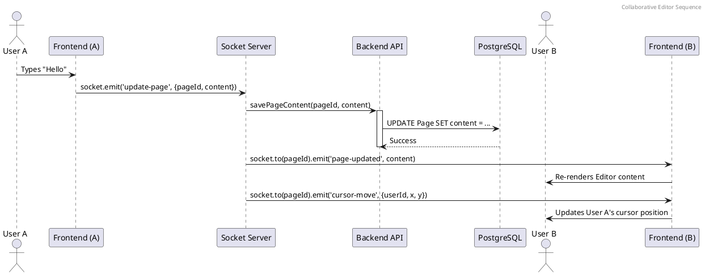

### 🔄 3.2 Real-time Chat Workflow (Чат мэдээлэл солилцох)
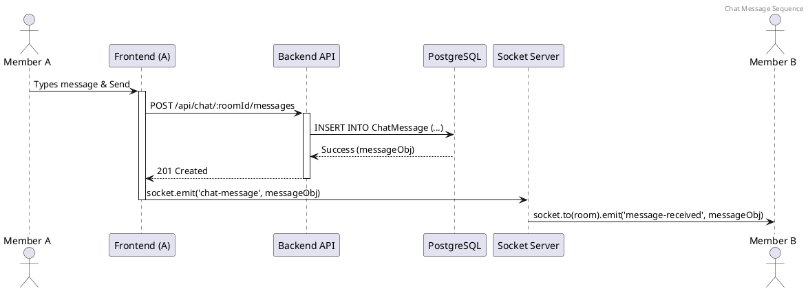

### 🔄 3.3 Collaborative Drawing Sync (Зураг синхрончлох)
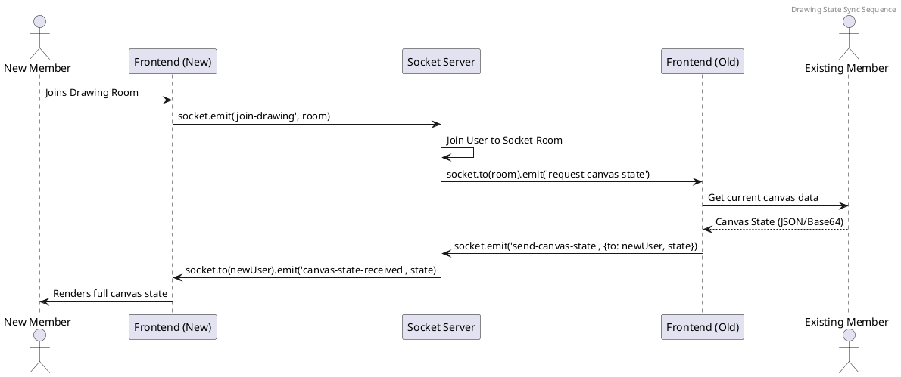

### 🏃 3.4 Activity Diagrams (Үйл ажиллагааны диаграмм)

Үйл ажиллагааны диаграмм нь системийн бизнес процесс болон логик урсгалыг харуулна. Хэд хэдэн хэрэглэгч болон системийн хэсгүүдийн хооронд үйл ажиллагаа хэрхэн дамжиж буйг "Swimlane" ашиглан дүрслэв.

#### A. User Registration & Automated Cleanup (Бүртгэл ба Цэвэрлэгээ)
Энэхүү процесс нь хэрэглэгч бүртгүүлэхээс эхлээд систем автоматаар баталгаажуулаагүй хэрэглэгчдийг устгах хүртэлх урсгалыг харуулна.

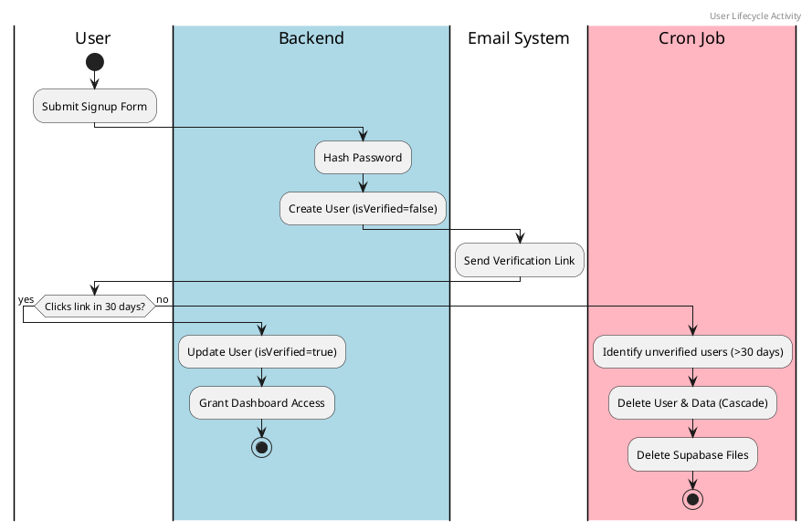

#### B. Workspace Invitation & Team Joining (Урилга ба Багт нэгдэх)
Урилга илгээх үйл ажиллагаа нь эзэмшигчээс эхлээд системээр дамжин уригдсан хэрэглэгчид хүрэх урсгал юм.

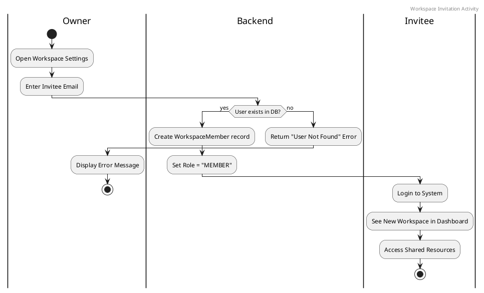

---

## 🏗 4. Structural Diagrams

### 📦 Component Diagram
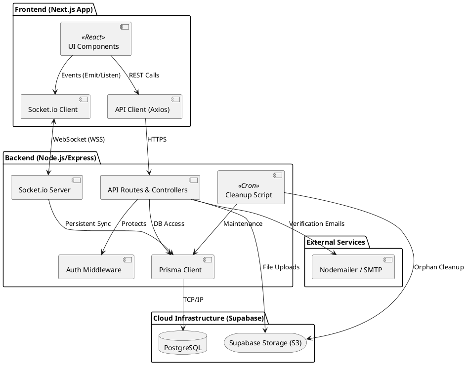

### 🚢 Deployment Diagram
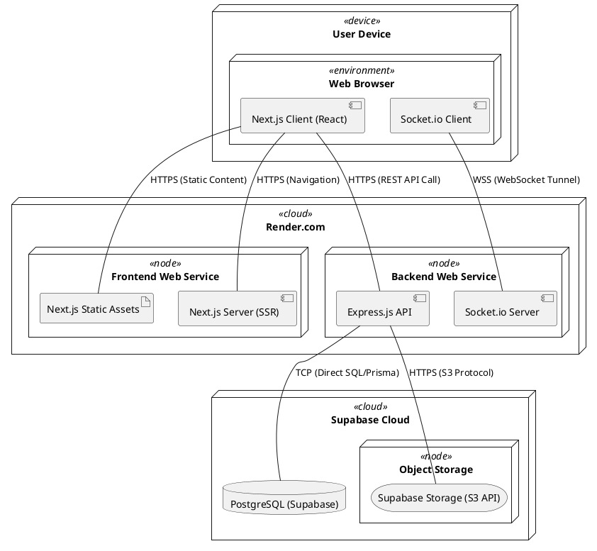


### 🌐 Network Diagram
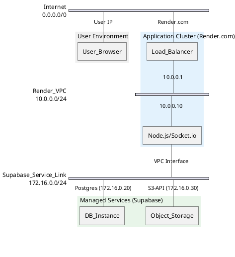

---

## 🧪 5. Тестчилэл (Testing)

Программыг онцгой тохиолдлууд болон системийн хязгаарлалтуудад шалгаж, гарсан үр дүнг доорх байдлаар баримтжуулав.

### 📋 Туршилтын тохиолдлууд

| Тест № | Туршилтын утга / Утга | Хүлээгдэж буй үр дүн | Бодит үр дүн | Яагаад энэ утгаар шалгасан бэ? |
| :--- | :--- | :--- | :--- | :--- |
| **TC-01** | 45MB хэмжээтэй Base64 зургийн дата илгээх | Систем амжилттай хадгалж, баазад бичигдэнэ. | ✅ Амжилттай | Express болон JSON body-д тогтоосон **50MB** хязгаарыг шалгах зорилготой. |
| **TC-02** | 30 хоногоос дээш хугацаанд баталгаажуулаагүй хэрэглэгч | Cron Job ажиллах үед хэрэглэгч болон түүний файлыг бүрэн устгана. | ✅ Амжилттай | `backend/src/scripts/cleanup.ts` логик зөв ажиллаж, Supabase Storage-оос файл устгаж буйг баталгаажуулах. |
| **TC-03** | Нэг хуудас дээр 2 хэрэгч нэгэн зэрэг шивэх | Сүүлийн засварлагчийн дата хадгалагдаж, Socket.io-оор бодит цагт синхрончлогдоно. | ✅ Амжилттай | Хамтын ажиллагааны (Concurrency) зөрчил үүсэх эсэх болон Socket.io-ийн ачаалал даах чадварыг шалгах. |
| **TC-04** | Буруу форматтай и-мэйл (test@invalid) | Систем "Invalid Email" алдаа зааж, бүртгэлийг зогсооно. | ✅ Амжилттай | Хэрэглэгчийн оролтын өгөгдлийн баталгаажуулалт (Validation) болон хамгаалалтыг шалгах. |
| **TC-05** | Ажлын талбарын эзэмшигчийг устгах оролдлого | Систем "Cannot remove owner" алдаа зааж, үйлдлийг цуцална. | ✅ Амжилттай | Ажлын талбарын аюулгүй байдал, өгөгдлийн бүрэн бүтэн байдлыг (Integrity) хамгаалах логикийг шалгах. |

### 🛠 Туршилтын дүгнэлт
Системийн гол хэсгүүд болох **Бодит цагийн синхрончлол** болон **Автомат цэвэрлэгээ** нь төлөвлөсөн логикийн дагуу ажиллаж байна. Ялангуяа 50MB-ын хязгаарлалт нь өндөр нягтралтай зургийн датаг алдаагүй дамжуулж байгаа нь баримтжуулалтаар нотлогдлоо.
